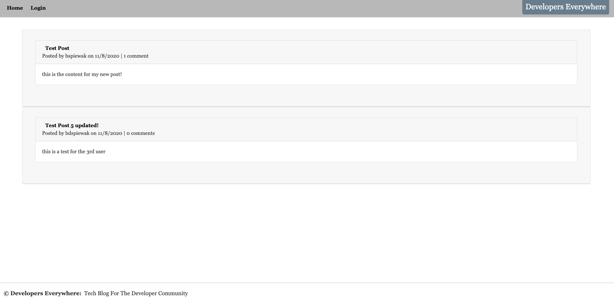
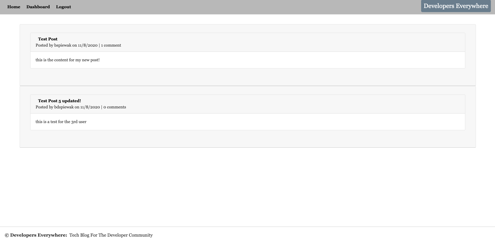
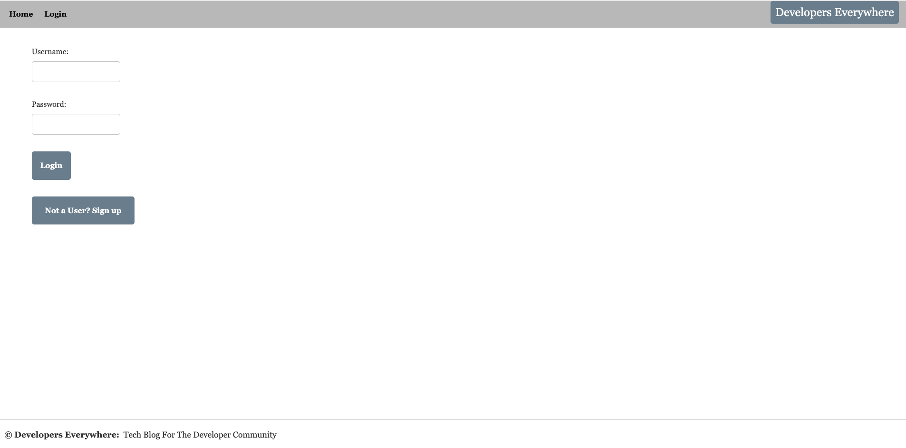
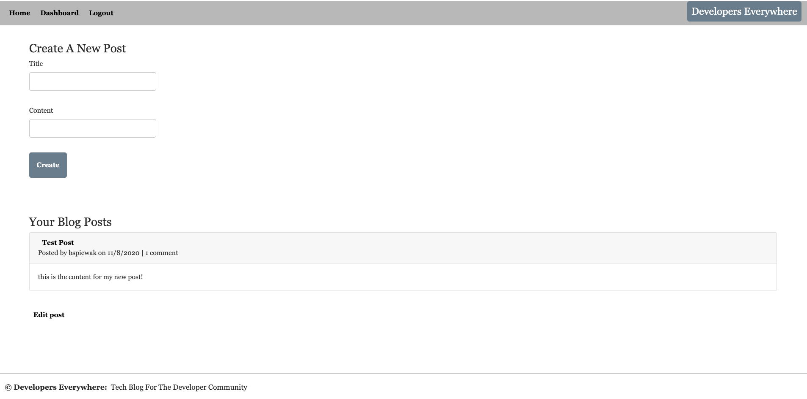

# Developers Everywhere Tech Blog

## Description
Developers Everywhere was designed for all developers to post to post about new applications, debugging codebases and also sharing insights on their own apps or other topics in the development world

## Table of Contents
* [Technologies](#technologies)
* [Screenshots](#screenshots)
* [Requirements](#requirements)
* [Links](#links)

## Technologies
1. JavaScript
2. Node.js
3. Express.js API
4. Sequelize
5. Model-View-Controller (MVC)
6. Handlebars.js
7. MySQL2

## Screenshots
#### Homepage - User not logged in

#### Homepage - User logged in

#### Login or Signup

#### User Dashboard including Create and Edit Posts

## Requirements
1. Create a CMS-style blog site that allows user to sign up and post comments
2. When the user visits the site, they are presented with the homepage that shows all posts
3. If the user decides to sign up and login, they can then write their own posts and comment on other users posts.
4. When the user logs in, they see their posts they created in the dashboard
5. Once they are on their dashboard, they can edit or delete their posts that they have created
6. Lastly, there is an option to logout of the site or it will automatically sign out after the user is idle for 5 minutes.

## Links
* [Developers Everywhere Tech Blog Application]()
* [Developers Everywhere Tech Blog Repository](https://github.com/bspiewak6/developer-techblog)

## License
  
This app is licensed under the MIT license.